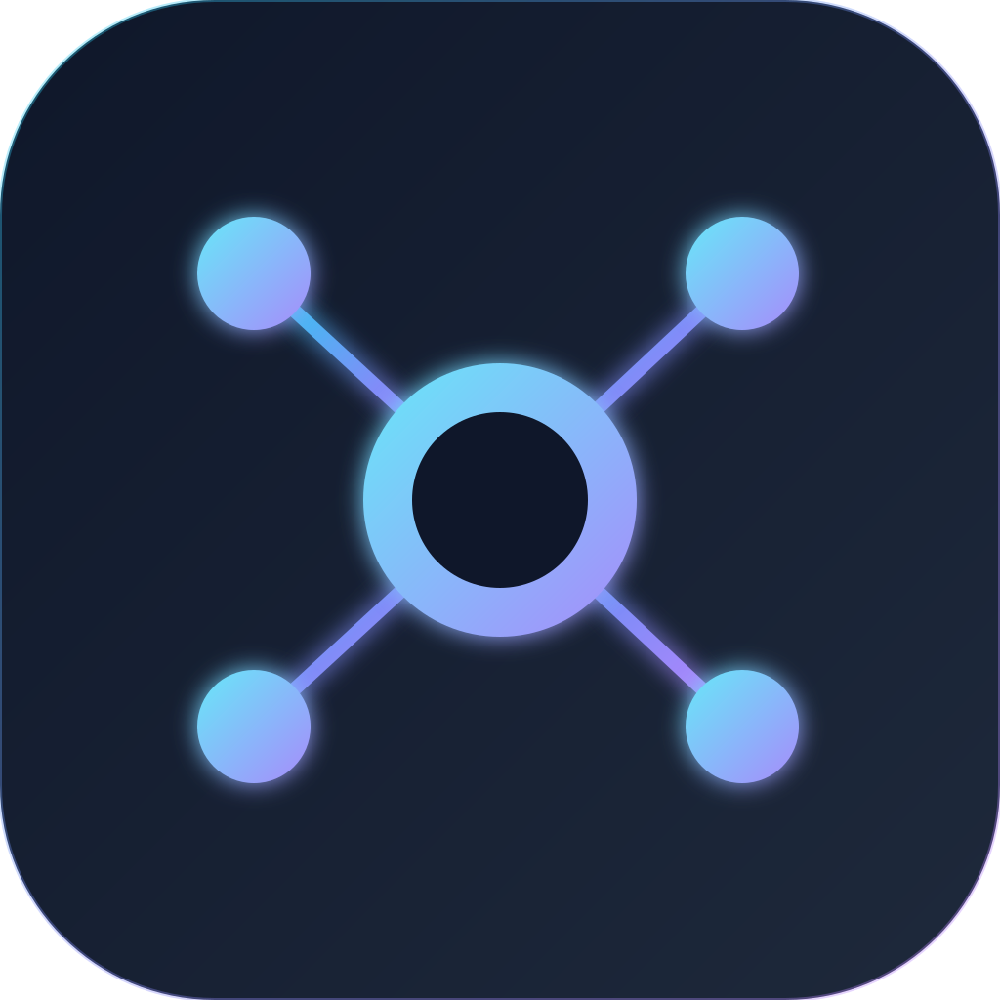
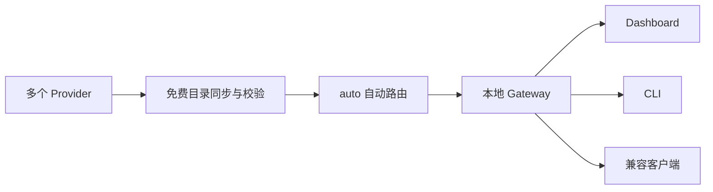

<div align="center">
  
  <h1>FreeModelFinder</h1>
  <p><strong>免费模型用完额度，自动换下一个。</strong></p>
  <p>把散落在多个平台的免费大模型，变成一个会自动接力的本地 API。</p>
  <p>内置 Dashboard、CLI 和 macOS 状态栏 App，兼容 OpenAI、Anthropic 与 Gemini 文本接口。</p>
  <p>
    <a href="https://www.npmjs.com/package/freemodelfinder"></a>
    <a href="FREE_MODELS.md"></a>
    <a href="https://github.com/orange90/FreeModelFinder/actions/workflows/ci.yml"></a>
    <a href="LICENSE"></a>
  </p>
  <p>
    <a href="FREE_MODELS.md">免费模型清单</a>
    · <a href="https://github.com/orange90/FreeModelFinder/releases/latest">下载 macOS</a>
    · <a href="#60-秒开始">60 秒开始</a>
    · <a href="#兼容-api">兼容 API</a>
    · <a href="docs/SERVER_MODE.md">服务器部署</a>
  </p>
</div>

> FreeModelFinder 聚合第三方平台当前可用的免费文本模型。它不会替你申请 API Key，也不能保证第三方免费政策、额度或可用性长期不变。

## 为什么需要它

- **免费模型散落在不同平台**：目录、价格规则和账号资格经常变化，手动确认成本很高。FreeModelFinder 统一同步目录，并把免费判定规则和失败来源显示出来。
- **一个免费额度很快用完**：使用模型 `auto` 后，路由器会按策略选择模型；遇到限流时记录冷却时间并尝试下一个可用来源。
- **每个客户端都要重复配置**：Provider Key 只需在本机配置一次，Web UI、CLI 和兼容 API 的客户端即可共用同一个入口。

## 今日免费模型

“免费”可能表示模型单价为零，也可能表示账号自带的受限开发额度；它不等于无限量、永久免费或适合生产环境。绑定计费项目、开启付费用量或越过赠送额度，都可能改变实际账单。

<!-- AUDIT-SUMMARY-START -->

> **目录审计于 2026-07-31（Asia/Shanghai）更新：65 个免费模型入口，覆盖 8/10 个 Provider。** 这里统计的是通过免费规则过滤的 Provider 模型入口，同一模型出现在多个 Provider 时会分别计数；本次未发送真实推理请求。

> 本次目录失败：GitHub Models、Cohere。

| Provider      | 状态    | 免费模型数 | 免费类型              |
| ------------- | ------- | ---------: | --------------------- |
| OpenRouter    | 🟢 正常 |         14 | 零价格模型            |
| Google Gemini | 🟢 正常 |          5 | 账号 Free Tier        |
| Zhipu AI      | 🟢 正常 |          2 | 官方免费型号          |
| SiliconFlow   | 🟢 正常 |          5 | 免费白名单            |
| ModelScope    | 🟢 正常 |          7 | 账号免费额度          |
| NVIDIA NIM    | 🟢 正常 |         27 | 免费开发端点          |
| GitHub Models | 🔴 失败 |   暂不可用 | 原型开发额度          |
| Cohere        | 🔴 失败 |   暂不可用 | 免费 Trial/Production |
| Hugging Face  | 🟢 正常 |          2 | 实时零价端点          |
| SenseNova     | 🟢 正常 |          3 | 实时零价模型          |

[查看稳定的完整免费模型清单](FREE_MODELS.md) · [查看本次目录审计报告](reports/provider-free-model-audit-2026-07-31.md)

### 今日变化

与 2026-07-30 相比，成功比较的 8 个 Provider 模型清单没有变化。

### 展开完整模型列表

<details>
<summary><strong>OpenRouter · 14 个模型</strong></summary>

- `openrouter:cohere/north-mini-code:free` — Cohere: North Mini Code (free)
- `openrouter:google/gemma-4-26b-a4b-it:free` — Google: Gemma 4 26B A4B (free)
- `openrouter:google/gemma-4-31b-it:free` — Google: Gemma 4 31B (free)
- `openrouter:inclusionai/ling-3.0-flash:free` — Ling-3.0-flash (free)
- `openrouter:nvidia/nemotron-3-nano-30b-a3b:free` — NVIDIA: Nemotron 3 Nano 30B A3B (free)
- `openrouter:nvidia/nemotron-3-nano-omni-30b-a3b-reasoning:free` — NVIDIA: Nemotron 3 Nano Omni (free)
- `openrouter:nvidia/nemotron-3-super-120b-a12b:free` — NVIDIA: Nemotron 3 Super (free)
- `openrouter:nvidia/nemotron-3-ultra-550b-a55b:free` — NVIDIA: Nemotron 3 Ultra (free)
- `openrouter:nvidia/nemotron-nano-12b-v2-vl:free` — NVIDIA: Nemotron Nano 12B 2 VL (free)
- `openrouter:nvidia/nemotron-nano-9b-v2:free` — NVIDIA: Nemotron Nano 9B V2 (free)
- `openrouter:openai/gpt-oss-20b:free` — OpenAI: gpt-oss-20b (free)
- `openrouter:openrouter/free` — Free Models Router
- `openrouter:poolside/laguna-s-2.1:free` — Poolside: Laguna S 2.1 (free)
- `openrouter:poolside/laguna-xs-2.1:free` — Poolside: Laguna XS 2.1 (free)

</details>

<details>
<summary><strong>Google Gemini · 5 个模型</strong></summary>

- `gemini:gemini-3.1-flash-lite` — Gemini 3.1 Flash Lite
- `gemini:gemini-3.5-flash` — Gemini 3.5 Flash
- `gemini:gemini-3.5-flash-lite` — Gemini 3.5 Flash Lite
- `gemini:gemma-4-26b-a4b-it` — Gemma 4 26B A4B IT
- `gemini:gemma-4-31b-it` — Gemma 4 31B IT

</details>

<details>
<summary><strong>Zhipu AI · 2 个模型</strong></summary>

- `zhipu:glm-4-flash` — GLM-4-Flash
- `zhipu:glm-4.7-flash` — GLM-4.7-Flash

</details>

<details>
<summary><strong>SiliconFlow · 5 个模型</strong></summary>

- `siliconflow:Qwen/Qwen2.5-7B-Instruct`
- `siliconflow:Qwen/Qwen3-8B`
- `siliconflow:tencent/Hunyuan-MT-7B`
- `siliconflow:THUDM/GLM-4-9B-0414`
- `siliconflow:THUDM/GLM-Z1-9B-0414`

</details>

<details>
<summary><strong>ModelScope · 7 个模型</strong></summary>

- `modelscope:Qwen/Qwen3-235B-A22B-Instruct-2507` — Qwen3-235B-A22B-Instruct-2507
- `modelscope:Qwen/Qwen3-235B-A22B-Thinking-2507` — Qwen3-235B-A22B-Thinking-2507
- `modelscope:Qwen/Qwen3-32B` — Qwen3-32B
- `modelscope:Qwen/Qwen3-Coder-30B-A3B-Instruct` — Qwen3-Coder-30B-A3B-Instruct
- `modelscope:Qwen/Qwen3-Next-80B-A3B-Instruct` — Qwen3-Next-80B-A3B-Instruct
- `modelscope:Qwen/Qwen3-Next-80B-A3B-Thinking` — Qwen3-Next-80B-A3B-Thinking
- `modelscope:Qwen/Qwen3-VL-235B-A22B-Instruct` — Qwen3-VL-235B-A22B-Instruct

</details>

<details>
<summary><strong>NVIDIA NIM · 27 个模型</strong></summary>

- `nvidia:deepseek-ai/deepseek-v4-flash`
- `nvidia:google/diffusiongemma-26b-a4b-it`
- `nvidia:google/gemma-4-31b-it`
- `nvidia:meta/llama-3.1-70b-instruct`
- `nvidia:meta/llama-3.1-8b-instruct`
- `nvidia:meta/llama-3.2-11b-vision-instruct`
- `nvidia:meta/llama-3.2-1b-instruct`
- `nvidia:meta/llama-3.2-3b-instruct`
- `nvidia:meta/llama-3.2-90b-vision-instruct`
- `nvidia:minimaxai/minimax-m3`
- `nvidia:mistralai/mistral-medium-3.5-128b`
- `nvidia:mistralai/mistral-nemotron`
- `nvidia:nvidia/ising-calibration-1.5-31b`
- `nvidia:nvidia/llama-3.1-nemotron-nano-vl-8b-v1`
- `nvidia:nvidia/llama-3.3-nemotron-super-49b-v1`
- `nvidia:nvidia/llama-3.3-nemotron-super-49b-v1.5`
- `nvidia:nvidia/nemotron-3-nano-30b-a3b`
- `nvidia:nvidia/nemotron-3-nano-omni-30b-a3b-reasoning`
- `nvidia:nvidia/nemotron-3-super-120b-a12b`
- `nvidia:nvidia/nemotron-3-ultra-550b-a55b`
- `nvidia:nvidia/nemotron-mini-4b-instruct`
- `nvidia:nvidia/nemotron-nano-12b-v2-vl`
- `nvidia:nvidia/nvidia-nemotron-nano-9b-v2`
- `nvidia:nvidia/riva-translate-4b-instruct-v1.1`
- `nvidia:openai/gpt-oss-120b`
- `nvidia:openai/gpt-oss-20b`
- `nvidia:stepfun-ai/step-3.7-flash`

</details>

<details>
<summary><strong>Hugging Face · 2 个模型</strong></summary>

- `huggingface:prism-ml/Ternary-Bonsai-27B-AWQ-4bit`
- `huggingface:prism-ml/Ternary-Bonsai-27B-gguf`

</details>

<details>
<summary><strong>SenseNova · 3 个模型</strong></summary>

- `sensenova:deepseek-v4-flash`
- `sensenova:glm-5.2`
- `sensenova:sensenova-6.7-flash-lite`

</details>

<!-- AUDIT-SUMMARY-END -->

`Custom` 是用户自行配置的 OpenAI-compatible 来源，不属于上述内置 Provider；价格、安全性和可用性需要由用户自行确认。

## 60 秒开始

### macOS 用户

从 [GitHub Releases](https://github.com/orange90/FreeModelFinder/releases/latest) 下载对应 DMG：Apple Silicon 选择 `arm64`，Intel Mac 选择 `x64`。把 FreeModelFinder 拖入“应用程序”后启动即可。

App 已自带本地 Gateway 和 Dashboard，不要求安装 Node.js、npm 或系统级 daemon。首次运行会引导你添加 OpenRouter 或 Gemini Key、同步免费模型并发送一次最小测试请求。

> 当前首版使用临时签名，尚未经过 Apple Developer ID 公证。请只安装来自本项目 GitHub Release 且 SHA-256 校验一致的文件。

<details>
<summary><strong>macOS 提示“无法验证开发者”时如何打开</strong></summary>

1. 下载同一 Release 中的 `SHA256SUMS`。在终端输入 `shasum -a 256 `（末尾留一个空格），把下载的 DMG 拖进终端并按回车，确认结果与记录完全一致。
2. 将 App 拖入“应用程序”，尝试打开一次，然后关闭 macOS 显示的风险提示。
3. 打开“系统设置 → 隐私与安全性”，滚动到“安全性”，找到 FreeModelFinder 后点击“仍要打开”。
4. 按系统要求验证身份，并在第二次确认框中选择“打开”。

“仍要打开”通常只在尝试启动后的约一小时内显示。不要全局关闭 Gatekeeper，也不要对来源不明或校验不一致的文件移除隔离属性。若系统提示文件“已损坏”，请删除后重新下载并再次校验。

参见 [Apple 官方说明](https://support.apple.com/zh-cn/guide/mac-help/-mh40616/mac)和 [FreeModelFinder macOS 使用说明](docs/MACOS.md)。

</details>

### npm / CLI 用户

npm/CLI 需要 Node.js 22.14 或更高版本：

```bash
npm install -g freemodelfinder
fmf serve --open
```

不想全局安装也可以直接运行：

```bash
npx freemodelfinder serve --open
```

浏览器会打开 <http://127.0.0.1:11435>。选择 OpenRouter（推荐）或 Gemini，粘贴 API Key；向导会自动同步模型、选择默认模型并完成连通性测试。

接下来可以在“测试”中直接对话，也可以把兼容 Base URL 填入其他客户端，并将模型设为 `auto`。

<details>
<summary><strong>常用 CLI 命令</strong></summary>

```bash
fmf status
fmf key add openrouter
fmf key list
fmf key remove openrouter
fmf model list
fmf model current
fmf model use openrouter:openrouter/free
fmf chat --model auto
fmf serve --port 11435
```

</details>

## 它如何工作



默认情况下，Gateway 只监听 `127.0.0.1`。模型目录、默认模型和路由状态由 Web UI、CLI 与 macOS 状态栏 App 共用。

## 核心功能

- **免费模型目录**：聚合多个内置 Provider，也支持同时配置多个自定义 OpenAI-compatible 来源；同步失败时保留上一轮可用目录。
- **三种自动路由策略**：`auto` 支持规格优先、速度优先和请求限制优先，遇到限流后自动冷却、切换，并在恢复后回到原偏好。
- **内置 Dashboard**：管理 Provider、Gateway Key 与自定义来源，查看模型变化和失败原因，并直接进行流式对话测试。
- **多协议文本接口**：提供 OpenAI、Anthropic、Gemini 兼容接口与 SSE 流式输出。
- **macOS 状态栏控制**：切换模型或路由策略、复制 curl/Python 接入代码、设置登录启动、查看日志和更新提醒。
- **本机凭据保护**：Provider Key、自定义来源 Key 和 Gateway Key 使用随机本地主密钥与 AES-256-GCM 加密保存。
- **显式服务器模式**：将 Tailscale 管理面与强制认证的公网 API 分离，FreeModelFinder 自身仍只监听 loopback。

## 兼容 API

模型建议填写完整的 `provider:model`，例如 `openrouter:openrouter/free`；填写 `auto` 则交给自动路由器。

| 协议      | Base URL                        | 文本聊天入口                      |
| --------- | ------------------------------- | --------------------------------- |
| OpenAI    | `http://127.0.0.1:11435/v1`     | `/chat/completions`               |
| Anthropic | `http://127.0.0.1:11435`        | `/v1/messages`                    |
| Gemini    | `http://127.0.0.1:11435/v1beta` | `/models/{model}:generateContent` |

最短 OpenAI-compatible 调用：

```bash
curl http://127.0.0.1:11435/v1/chat/completions \
  -H 'content-type: application/json' \
  -d '{
    "model": "auto",
    "messages": [{"role": "user", "content": "你好，请介绍一下自己"}]
  }'
```

Gateway 认证默认关闭。启用 Gateway Key 后，请增加 `Authorization: Bearer <FMF_GATEWAY_KEY>`；也支持 `x-api-key` 和 `x-goog-api-key`。完整的三种协议、流式调用和健康检查示例见 [API 使用说明](docs/API.md)。

## 适合与不适合

| 适合                                   | 暂不适合                                |
| -------------------------------------- | --------------------------------------- |
| 想统一管理多个免费模型来源             | 需要生产级 SLA 或高并发                 |
| 希望免费额度用尽后自动切换             | 需要 Tool / Function Calling            |
| 想给文本聊天客户端提供统一 API         | 需要图片、音频等多模态能力              |
| 希望 Provider Key 和网关默认只留在本机 | 希望在本机直接运行模型；这更适合 Ollama |

## 配置与安全

- 默认配置位于 `~/.freemodelfinder`；`config.json` 保存 v3 加密密文，随机主密钥单独保存在 `master.key`。
- 在支持 POSIX 权限的系统上，配置目录使用 `0700`，配置文件和主密钥使用 `0600`。这不是系统 Keychain；同一操作系统账户下的其他进程仍处于信任边界内。
- `/api/*` 管理接口只接受来自 loopback 且带本地 UI Origin/Referer 的请求；兼容协议端点可使用 Gateway Key 保护。
- 出站 Provider 请求支持 `HTTPS_PROXY`、`HTTP_PROXY`、`ALL_PROXY` 及对应小写变量，只支持 HTTP/HTTPS 代理。
- 免费目录和本地配额估算不能替代 Provider 控制台的账单、配额或使用条款。
- 首次向导只会报告受支持的环境变量是否存在，不会把原始值返回浏览器，也不会未经确认自动导入。

通过 `FREEMODELFINDER_HOME` 可以修改配置目录：

```bash
FREEMODELFINDER_HOME=/path/to/fmf-home fmf serve
```

端口占用、模型同步失败、代理、日志、重置配置和卸载说明见 [排障指南](docs/TROUBLESHOOTING.md)。

## 服务器模式

服务器模式为显式开启的高级部署方式：管理端交给 Tailscale Serve，API 端交给绑定具体公网 IP 的 Nginx；公网 API 强制使用 Gateway Key，且不会注册 Dashboard 或 `/api/*` 管理路由。

```bash
fmf serve \
  --mode server \
  --admin-origin https://your-server.your-tailnet.ts.net \
  --public-url https://203.0.113.10
```

完整的 systemd、Tailscale、Nginx、Certbot 与安全自检步骤见 [服务器模式部署文档](docs/SERVER_MODE.md)。

## 当前限制与 Roadmap

v0.1 只承诺常用文本聊天字段与流式文本增量，不是三家 SDK 的完整替代实现。以下未完成项是候选方向，不代表发布时间承诺。

- [x] 免费目录、Dashboard、CLI 与 macOS 状态栏 App
- [x] OpenAI、Anthropic、Gemini 兼容文本接口
- [x] 多策略自动路由、限流冷却与来源切换
- [ ] Tool / Function Calling
- [ ] 图片、音频等多模态输入输出
- [ ] 同一 Provider 的多 Key 轮询
- [ ] Ollama fallback
- [ ] Docker、Homebrew 和自动下载安装更新
- [ ] Apple Developer ID 签名与公证

流式响应中途失败后，当前不会在同一次请求内无缝回退。

## 从源码开发

仓库使用 pnpm workspace，要求 Node.js 22.14+ 和 pnpm 11：

```bash
corepack enable
pnpm install --frozen-lockfile
pnpm typecheck
pnpm test:coverage
pnpm build
pnpm test:pack
```

开发模式下可以分别启动 Gateway 与 UI：

```bash
pnpm dev:server
pnpm dev:ui
```

UI 位于 `http://localhost:3000`，默认连接 `http://127.0.0.1:11435`。macOS App 的构建还需要 Rust 1.86+ 和 Xcode Command Line Tools，详见 [macOS 使用说明](docs/MACOS.md)。

欢迎通过 Issue 报告可复现的问题、提交 Provider 信息或提出功能建议。提交 PR 前请运行与改动范围对应的格式、类型和测试检查。

## 文档与许可

- [每日免费模型清单](FREE_MODELS.md)
- [API 使用说明](docs/API.md)
- [macOS 使用说明](docs/MACOS.md)
- [排障指南](docs/TROUBLESHOOTING.md)
- [服务器模式部署](docs/SERVER_MODE.md)
- [变更记录](CHANGELOG.md)
- [安全问题报告](SECURITY.md)
- [发布维护手册](docs/RELEASING.md)

本项目采用 [MIT License](LICENSE)。
